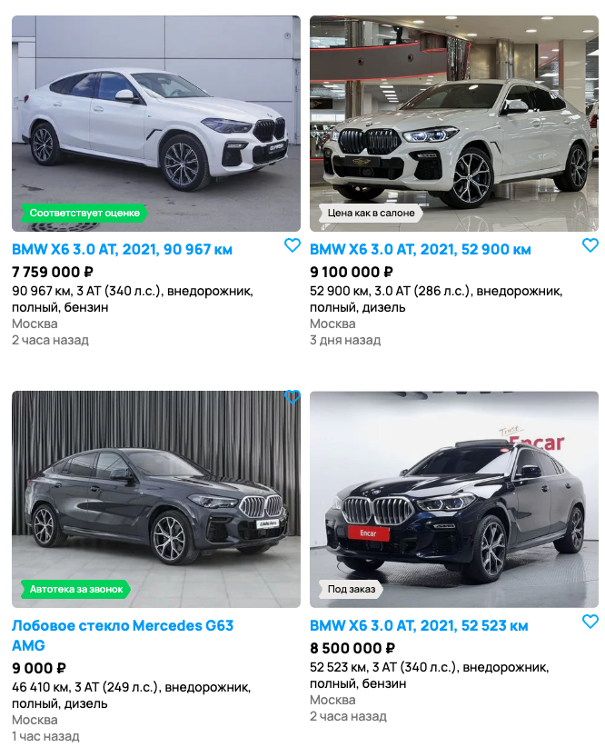
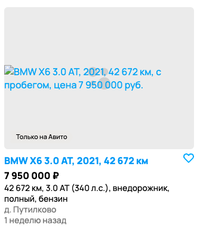
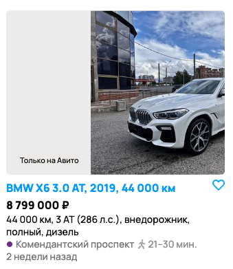
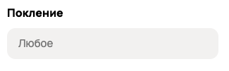
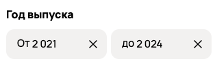

# Задание 1
*Изучите скриншот, перечислите все имеющиеся баги, изображенные на нем, и укажите их приоритет (high, medium, low).*

Шаги воспроизведения одинаковы для всех багов :
* Перейти на сайт [Авито](https://avito.ru/)
* Выбрать категорию  "Транспорт", затем "Автомобили" либо выбрать плитку "Авто" на главной странице
* Установить фильтры:
> 1. Город поиска - Санкт-Петербург 
> 2. Марка: BMW 
> 3. Модель: X6 
> 4. Цена: до 10 000 000 
> 5. Год выпуска: от 2021 до 2024 
> 6. Привод: полный
* Нажать кнопку показать n объявлений
## High priority bugs ##
1. **Отображение объявления, не подходящего по фильтрам "Марка" и "Модель"**

<u>Ожидаемый результат</u>

Отображение автомобилей, соответствующие фильтрам.

<u>Фактический результат</u>

Среди результатов поиска присутствует "Mercedes-Benz C-класс 1.5 AT...", что не соответствует фильтрам.

2. **Отображение объявлений, не подходящего по фильтру "Регион"**

<u>Ожидаемый результат</u>

Отображение объявлений только из Санкт-Петербурга.

<u>Фактический результат</u>

Среди результатов поиска присутствует предложения из д. Путилково, Москвы, и Планеты Сатурн что не соответствует фильтру.

3. **Отображение объявления, не подходящего по фильтру "Год выпуска"**

<u>Ожидаемый результат</u>

Отображение объявлений, в которых машина была произведена в период с 2021 по 2024.

<u>Фактический результат</u>

Среди результатов поиска присутствует предложение о продаже машине 2019 года производства , что не соответствует фильтру.

4. **Отображение объявления, не подходящего по фильтру "Привод"**

<u>Ожидаемый результат</u>

Отображение объявлений, в которых машина имеет полный привод.

<u>Фактический результат</u>

Среди результатов поиска присутствует предложение о продаже машине с передним приводом , что не соответствует фильтру.

## Medium priority bugs ##

5. **Отображение объявления, о продаже лобового стекла среди предложений с продажей машины**

<u>Ожидаемый результат</u>

Отображение объявлений, в которых только машины с заданными фильтрами.

<u>Фактический результат</u>

Среди результатов поиска присутствует предложение о продаже лобового стекла для Mercedes G63 AMG.

6. **Отображение объявления с отсутствующим изображением**

<u>Ожидаемый результат</u>

Отображение объявлений, в которых будут корректные изображения.

<u>Фактический результат</u>

Среди результатов поиска присутствует предложение с серым прямоугольником.

7. **Метка "Соответствует оценке" располагается за пределами изображения объявления**

<u>Ожидаемый результат</u>

Отображение объявлений, в которых метка "Соответствует оценке" располагается корректно (в нижней левой части фотографии).

<u>Фактический результат</u>

Среди результатов поиска присутствует предложение с некорректной меткой "Соответствует оценке".

8. **Иконка "Добавить в избранное" расположена в неправильном месте**

<u>Ожидаемый результат</u>

Отображение объявлений, в которых иконка "Добавить в избранное" располагается корректно (в нижней правой части).

<u>Фактический результат</u>

Среди результатов поиска присутствует предложение с некорректным расположением иконки.

9. **Текст "Только на Авито" расположен неправильно и закрывает фотографию объявления**

<u>Ожидаемый результат</u>

Отображение объявлений, в которых текст "Только на Авито" располагается корректно.

<u>Фактический результат</u>

Среди результатов поиска присутствует предложение с некорректным расположением текста.

10. **Отсутствие текста на кнопке на баннере**

<u>Ожидаемый результат</u>

Корректное отображение текста на кнопке.

<u>Фактический результат</u>

Отсутствие текста на кнопке.

## Low priority bugs ##

11. **Пропущена буква в фильтре**

<u>Ожидаемый результат</u>

Отсутствие орфографических ошибок.

<u>Фактический результат</u>

Фильтр "Поколение" написан с ошибкой - "Покление".

12. **Некорректное отображение года**

<u>Ожидаемый результат</u>

Год в фильтре будет выглядеть как четырёхзначное число без пробела между 1 и 2 цифрой ("2024").

<u>Фактический результат</u>

Год выглядит так - "2 024".

